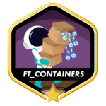
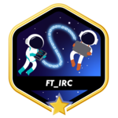

<h1 align="center">Hi 👋, I'm Ilyass Bougajdi</h1>
<h3 align="center">Passionate Developer • DevOps Enthusiast • Student @ 1337</h3>

A passionate DevOps Engineer from Morocco, currently mastering the art of automation, containerization, and cloud infrastructure. I'm fascinated by how modern DevOps practices revolutionize software delivery and system reliability. I love exploring new technologies and leveraging them to build scalable and efficient infrastructure 🛠️

 
 

 

  
<h3 

- 🔧 I’m currently building containerized applications with Docker

- 🚀 Exploring cloud infrastructure and DevOps best practices

- 🌐 Interested in cloud-native architecture and microservices

- 🛠️ Passionate about infrastructure as code and system automation

- 🌱 Learning more about monitoring and observability tools

- 🌱 learning advanced Kubernetes & CI/CD pipelines

- 👯 I’m looking to collaborate on open-source DevOps tools

- 💬 Ask me about C, C++, Docker, Kubernetes, and Linux
    
 

&nbsp;&nbsp;&nbsp;&nbsp;&nbsp;&nbsp;&nbsp;&nbsp;&nbsp;&nbsp;&nbsp;&nbsp;&nbsp;&nbsp;&nbsp;&nbsp;&nbsp;&nbsp;&nbsp;
  

## 🛠 Core Competencies & Technologies

**Programming & Scripting**

  

**DevOps, Cloud & IaC**

  

**Observability & Monitoring**

  

**Databases & Caching**

  

**System Administration & CI/CD**

  

 

&nbsp;&nbsp;&nbsp;&nbsp;&nbsp;&nbsp;&nbsp;&nbsp;&nbsp;&nbsp;&nbsp;&nbsp;&nbsp;&nbsp;
  

## 42 Project - Badges

            

  

## GitHub Stats

 <picture>
  <source media="(prefers-color-scheme: dark)" srcset="https://raw.githubusercontent.com/Jagoda11/Jagoda11/output/github-snake-dark.svg">
  <source media="(prefers-color-scheme: light)" srcset="https://raw.githubusercontent.com/Jagoda11/Jagoda11/output/github-snake.svg">
  
</picture>

    
    
    
    
    
    
    
    
    
    
    
    
    
    
    
    
    
    
    
    
    
    
    

_Last updated: **Sunday, March 1st, 2026, 06:50:45 AM**_
  

